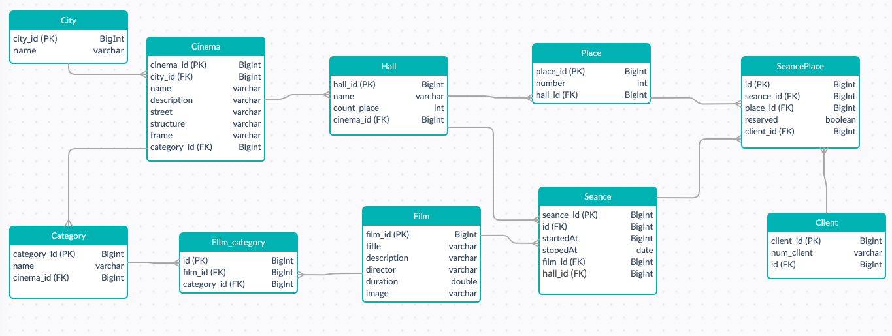

# ProjectCinema 
Система для сети кинотеатров.
Есть возможность добавления сеансов, фильмов, категорий, холлов, кинотеатров и городов.
Имеется опция по добавлению изображения к фильму. Каждый фильм может иметь несколько категорий. 
Категории дополнительно привязываются к кинотеатрам, для того, чтобы в дальнейшем организовать 
разграничение доступа для администраторов кинотеатров. Есть возможность оформления билетов на нужные сеансы. 
Билеты привязываются к SeancePlace, то есть к местам именно сеанса. Эти места генерируются автоматически, когда сеанс создается. 
Места, привязанные к холлу, тоже генерируются автоматически в колиечестве, которое указывается при создании холла. 
Used frameworks:
Spring(data jpa, web, boot)
Система сборки: maven

